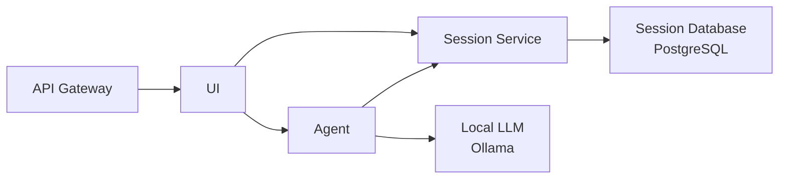

# Block Diagram Service

A service that generates block diagrams using an LLM. It takes user descriptions, converts them to Mermaid code, and provides chat and diagram rendering in a web UI.

---

## Architecture

- **UI** → **Agent** (Python + Google ADK) → **LLM** (Google Gemini or local models such as KServe/Ollama)
- **Sessions**: Both the UI and the agent use **Session Service** for session data. Only Session Service connects to PostgreSQL; the agent does not connect to the DB directly.
- LLM selection is controlled by whether `LLM_BASE_URL` / `KSERVE_URL` are set.



---

## Folder Structure and Roles

| Folder | Role |
|--------|------|
| `src/session-service` | Session-only microservice. Connects to PostgreSQL; exposes ADK-compatible REST API (session CRUD, event append). Used by UI and agent. |
| `src/agent` | Python + Google ADK agent. Diagram generation logic. Structured output (title / message / mermaid) via Pydantic. Accesses sessions via Session Service HTTP client. |
| `src/ui` | Web UI (chat + Mermaid rendering). Left: session list and chat; right: Mermaid diagram. Session API can be pointed at Session Service or agent. |
| `src/k8s` | Kubernetes manifests. `block-diagram` namespace (PostgreSQL, Session Service, agent, UI, LLM). Apply with Kustomize. |
| `scripts` | Local dev (`dev-local.sh`), image build (`build-images.sh`), K8s deploy (`deploy-k8s.sh`, `rebuild-and-deploy.sh`). |

For detailed descriptions, tech stack, and run instructions, see **AGENTS.md** in each folder.

- Agent: `src/agent/AGENTS.md`
- UI: `src/ui/AGENTS.md`
- Session Service: `src/session-service/AGENTS.md`
- K8s, deployment, LLM: `src/k8s/AGENTS.md`
- Scripts: `scripts/README.md`

---

## Local Development

**Run agent + UI only without DB (in-memory sessions):**

```bash
# Configure LLM in .env (Gemini: GOOGLE_API_KEY / local LLM: LLM_BASE_URL or KSERVE_URL)
cp .env.example .env   # if needed
./scripts/dev-local.sh
```

| Target | URL |
|--------|-----|
| Agent | http://localhost:8080 |
| UI | http://localhost:3000 |

**With Session Service + PostgreSQL:**  
Start Session Service first, then run the agent with `SESSION_SERVICE_URL=http://localhost:8081`. See `src/session-service/AGENTS.md` and `src/agent/AGENTS.md` for details.

---

## Deployment (Kubernetes)

- **Apply all:** `./scripts/deploy-k8s.sh` or `kubectl apply -k src/k8s`
- **Build images and redeploy:** `./scripts/rebuild-and-deploy.sh [session-service|agent|ui|all]`
- **Build images only:** `./scripts/build-images.sh [session-service|agent|ui|all]`

Secrets (`GOOGLE_API_KEY`, PostgreSQL credentials, etc.) are set in `src/k8s/secret.yaml` or via CI/CD. Keep secrets in `.env` and do not commit them (`.gitignore` includes `.env`).

For deployment details, Ingress, port-forwarding, and LLM (Ollama) integration, see `src/k8s/AGENTS.md` and `scripts/README.md`.

---

## Summary

- **Project goal**: Build a service that turns user descriptions into Mermaid diagrams via an LLM.
- **Components**: Session Service (Go, PostgreSQL) · Block Diagram Agent (Python, ADK, LiteLLM) · Web UI (HTML/CSS/JS, Mermaid.js) · K8s manifests.
- **Docs**: Root `AGENTS.md`, each folder’s `AGENTS.md`, and `scripts/README.md`.
